# lgame-examples

Here are provided examples showing how to use lgame (and sdl2 under the hood) to
accomplish various things.

Scroll down further if you just want to see some screenshots.

Most of them are based on corresponding [pygame
examples](https://github.com/pygame/pygame/tree/main/examples)

Others are based on things found elsewhere in the lisp gamedev world, or are
based entirely of my own creation.

Still others (in the future) are large and complex enough (or are too derivative
of something not public domain licensed) that I will instead provide links in
this readme to their respective projects.

If you ever use lgame yourself, feel free to ping me/make a pull request to put
your link here!

# Running

Each example here is made to be run as a standalone script with `sbcl --script
example/example.lisp`. They share the feature that their first line quickloads
lgame (so be sure to setup lgame first so that quicklisp can find it). Included
is a `run-all.sh` if you just want to run them and see what's here.

Every example *should* be compile-file-and-load-able into your running Lisp
session, after which you can have your editor eval the example's main or
explicitly execute `(lgame.example.EXAMPLE-NAME:main)` to run the example. Note
for `taste/taste.lisp` it will immediately start executing after loading, as if
you had called `(load "taste/taste.lisp")` from a fresh REPL directly. When you
execute a particular example's `main`, some will take over your REPL thread
until you close them, but others make use of
[livesupport](https://github.com/cbaggers/livesupport) to leave your REPL
functional and allow you to interactively modify the examples as they're
running.

`lgame-examples.asd` exists to load all (but `taste`) into one system, but this
is mainly used to facilitate checking for breaking changes with `sblint`.

# Examples

Under the pygame-inspired section examples are listed roughly in order of
complexity. None can be called "good ideas" in the sense of being instructive in
how to more properly structure code (that will require a bigger example in the
[External](#external) section) but, where the documentation of lgame itself lacks, should
provide at least enough clues for how to get started. Always remember that the
SDL2 way of doing something is the canonical way with lgame, so you should
become familiar with SDL2's API to be fully effective.

## pygame-inspired

* Taste -- almost the simplest possible example, not a great pattern to build
  on, but shows the general flow of init -> setup screen -> load a ball image ->
  enter game loop -> detect the quit event -> bounce the ball around.

  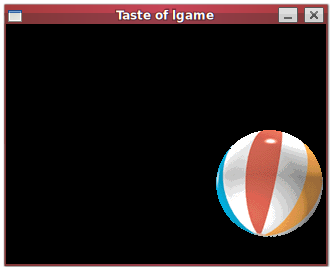
* Snake -- another simple example with not great style, but uses SDL draw
  primitives instead of sprites.

  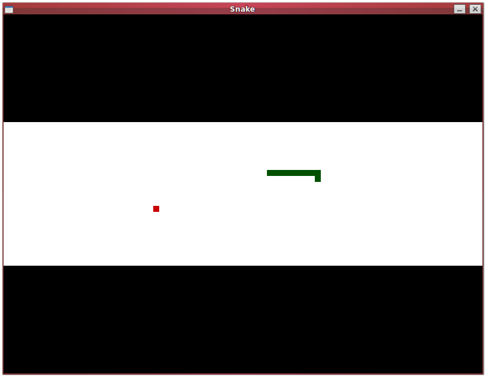
* Moveit -- builds on Taste by wrapping stuff in a main function and having more
  sprites, but is missing needed memory management.

  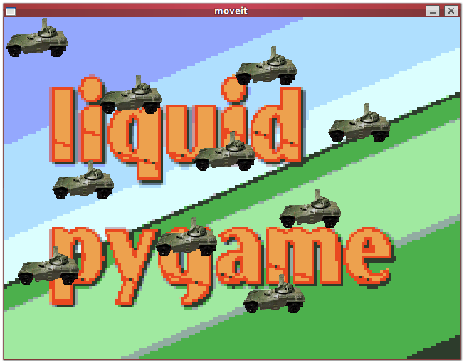
* Liquid -- introduces a 60 FPS limiting clock, shows a cool liquidy effect
  achieved by rendering chunks of a texture at offsets from each other.

  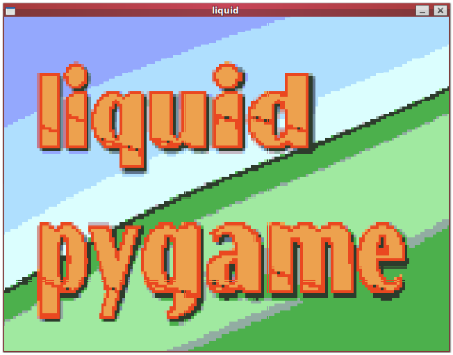
* Testsprite -- simple little benchmark drawing 100 (or more if you want)
  sprites bouncing around and showing FPS on quit. Introduces the lgame.loader and
  lgame.sprite packages, with each sprite being in its own object all inside a
  single sprite group.

  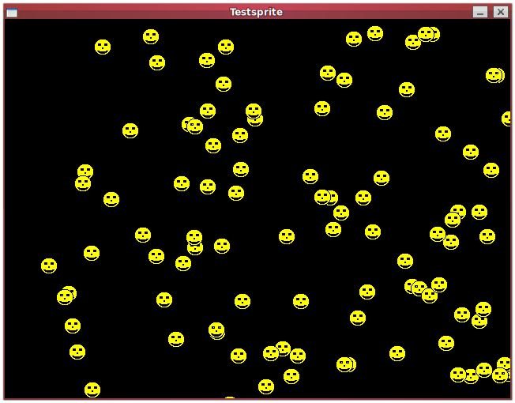
* Chimp -- Bigger example with sprites, sound effects, and mouse interaction.
  Shows off more of the lower level direct SDL2 calls instead of the nicer
  wrapping lgame ones.

  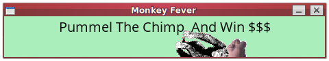
* Vgrade -- On the surface a simpler example, just shows mixing window flags (in
  this case borderless mode) and paints a new color gradient every frame. It
  prints out how long it took to render each gradient, and thus your max
  framerate if that's all you were doing. Inside the file are three ways of
  creating such a gradient that you can play with interactively by changing
  which version to use in the render loop. They show using a buffer approach
  (default, putting pixel-by-pixel data into a Lisp array and copying to a
  foreign texture), a filled-rects approach (successive render-fill-rect calls
  for each row), and a points approach (successive render-draw-point calls for
  each pixel).
  The performance differences between the methods are significant. The
  conclusion to draw is that if you have a lot of graphics data, it will pay to
  be able to manipulate it through foreign memory rather than pay a cost each
  frame to translate it from Lisp memory.

  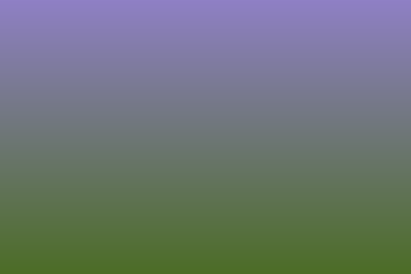
* Aliens - almost an actual game! Sprites, music, sfx, animations, creating a
  background from a (in this case screen height) tile.. shows some more
  experimental features of lgame like some sprite mixins to handle group
  membership or resource cleanup of many sprites being created and killed over
  time. This could be made immediately cleaner by moving each sprite to its own
  file, but whatever.

  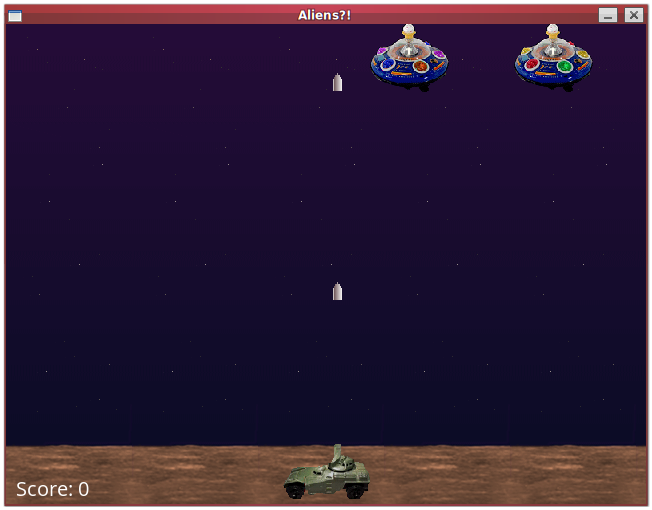

## Others

* gamekit-hello-comparison -- short example showing how trivial-gamekit's 4-line
  hello-world can be done in quite a few more lines with lgame. If you don't
  need the fine-grained lower-level control that lgame demands, trivial-gamekit
  should be your first stop...

  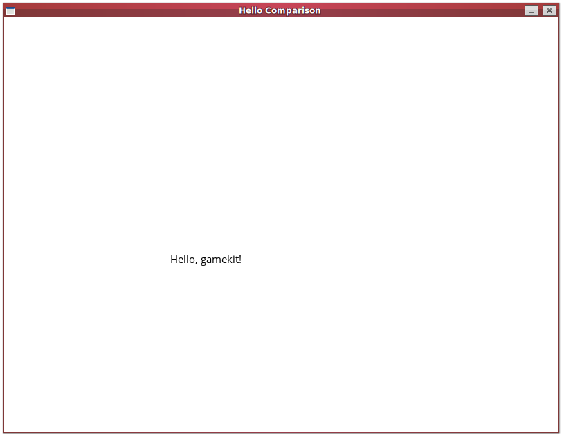
* gl -- a short example showing how to use this with OpenGL and the classic (and obsolete)
  immediate mode API.

  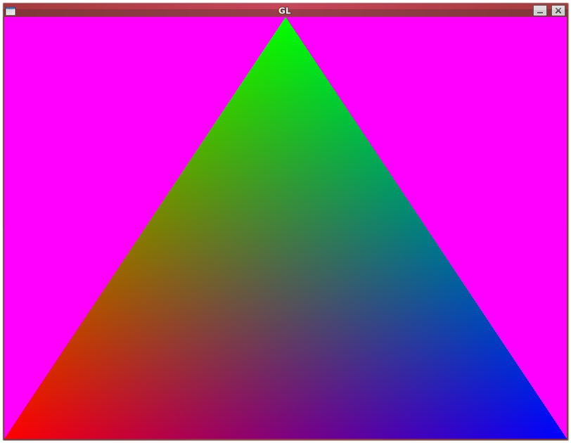
* gl2 -- another short OpenGL example but this time using a more modern OpenGL
  3.1 core and demonstrating how to compile and use a shader (which could be put
  out into its own file and read from, here I just embedded it as a string).

  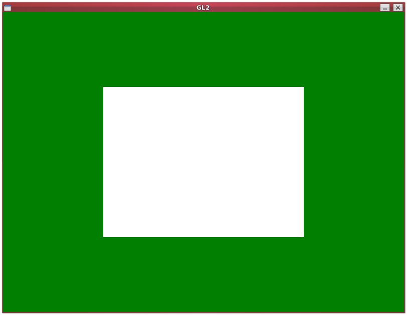
* Maze -- a port of an old maze generation program I made in pygame. Inside is
  also an example of using the A\* pathfinding hook in lgame to solve the maze.

  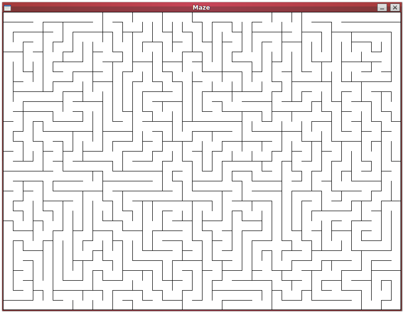
    * The next 3 screenshots show a solved maze with A\*, and then
    a custom map with a solved path using A\* with the Manhattan distance heuristic,
    then using the Euclidean distance heuristic, and finally using the Floyd-Warshall
    algorithm.
  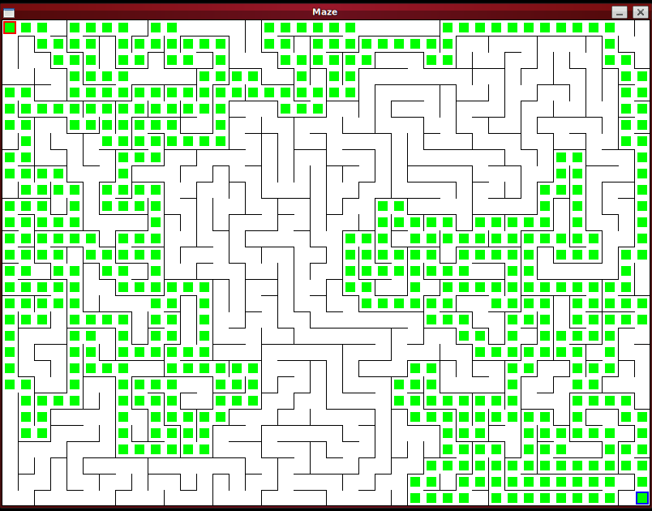
  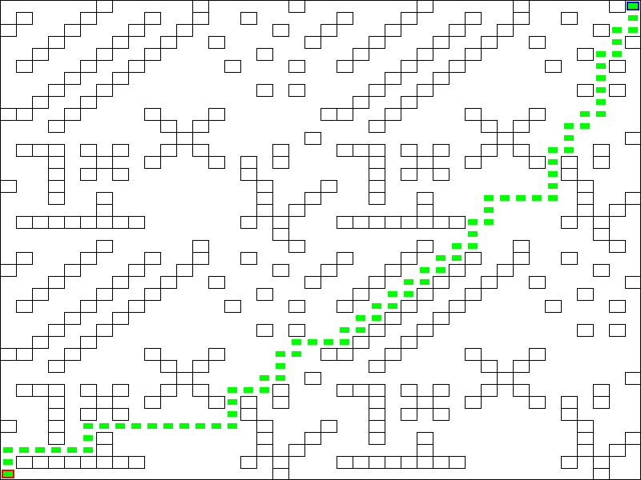
  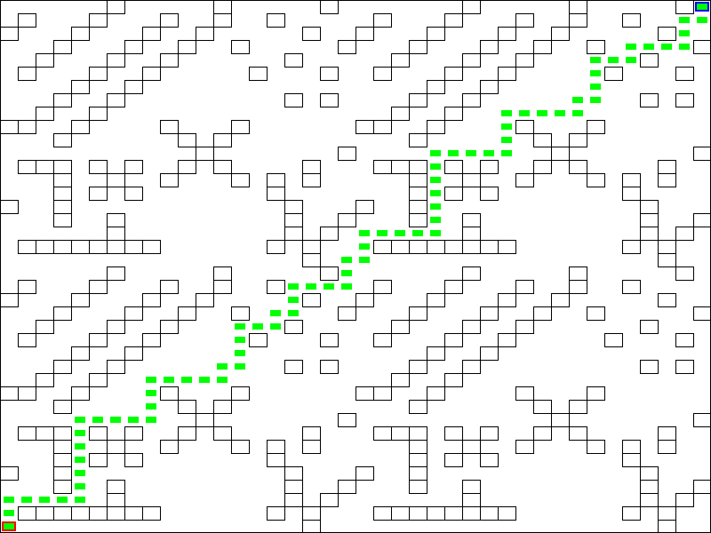
  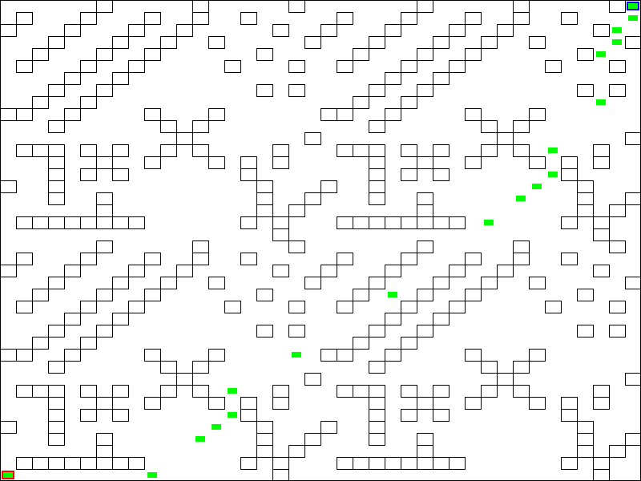

## External

# Motivation

The original goal of these examples was to help whip lgame into something
resembling working order and to be a bit more broadly usable than just what my
WIP games need at the moment. The ongoing goal is to continue making more
examples, especially if I can make narrow targeted examples based on extracts
from my games. The more things I make the more I realize what should change or
not or what really needs to be added.

As a secondary goal, having more examples to learn from (even bad examples!) is
what helps build a community. Pygame has an excellent documentation site, as
well as some simple tutorials, but it's the community and wide availability of
bigger games and libraries with open source code that has made it what it is.
With the source to a bigger game it's possible to learn so much more than what
the docs suggest, even very good docs. So more code instead of docs is my
priority, though of course in the future it'd be nice to have more and better
docs, but first there should be something worth documenting, which so far lgame
isn't.

Even if someone doesn't want to use lgame, just having examples show up in
searches may at least provide inspiration for how to do something with cl-sdl2,
or just generically in Lisp. The twice-a-year [lisp game
jams](https://itch.io/jam/autumn-lisp-game-jam-2021) certainly have been
expanding just fine without any of my contribution, I think it'd be cool if I
can help not just myself but even one other person contribute something.

# License

Like lgame itself these examples are all licensed under the Unlicense, that is,
are in the public domain.

Certain assets may have their own licenses, I've tried to call them out in the
project/asset folders if so under a LICENSE file for that folder.

Pygame's own examples (https://github.com/pygame/pygame/tree/main/examples) that
many of these are based on are noted to be in the public domain.

